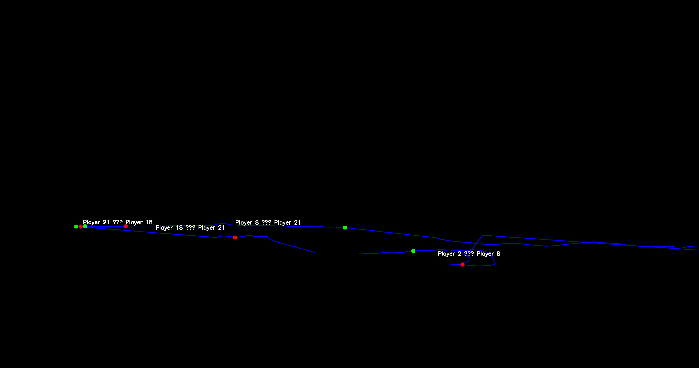
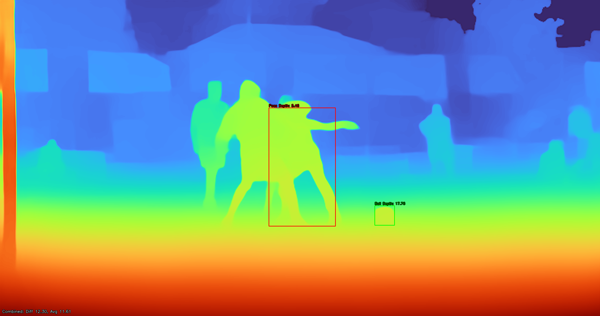

# Football Video Analysis

This project analyzes football match videos using the YOLOv12 model and ByteTrack to detect and track players and the ball. Additionally, it integrates depth estimation using MiDaS to analyze spatial positioning. It annotates the video with real-time statistics (e.g., ball speed, possession), tracks passes, generates depth maps, and provides detailed analytics like ball trajectory and possession time. Outputs include an annotated video, CSV data files, graphs, depth maps, and summary images—all saved in a `results/` directory.

## Features
- **Object Detection & Tracking**: Identifies players and the ball using YOLOv12 and tracks them across frames with ByteTrack.
- **Depth Mapping**: Utilizes MiDaS to generate depth estimations of the players and ball, helping analyze their spatial position.
- **Real-Time Annotations**: Displays bounding boxes, player IDs, possession status, ball trajectory, and depth cues on the video.
- **Analytics**:
  - Ball distance, speed, and acceleration.
  - Possession tracking with player-specific times.
  - Pass detection with key frame captures.
  - Depth estimation of players and ball per frame.
- **Outputs**:
  - Annotated video (`results/video/annotated_football_match.mp4`).
  - CSV files for ball trajectory, possession, passes, and depth (`results/data/`).
  - Graphs of detections, ball distance, and depth analysis (`results/graphs/`).
  - Depth maps for each frame (`results/depth_maps/`).
  - Summary image of ball trajectory, passes, and depth analysis (`results/images/`).

## Demo
### Ball Trajectory and Passes
  
*Example of the ball trajectory with pass annotations (output saved as `ball_trajectory_and_passes.png`).*

### Depth Maps
  
*Example of a depth map generated using MiDaS.*

## Prerequisites
- **Python**: 3.8 or higher.
- **Video File**: An MP4 video of a football match (not included due to size; provide your own).
- **Hardware**: A decent CPU/GPU for faster processing (YOLO supports CUDA if available).

## Installation
1. **Clone the Repository**: Includes the `yolo12n.pt` model file.
   ```bash
   git clone https://github.com/omkedar10/football-video-analysis.git
   cd football-video-analysis
   ```

2. **Set Up a Virtual Environment**
   ```bash
   conda create --name football-env python=3.8 -y
   conda activate football-env
   ```

3. **Install Dependencies**
   ```bash
   pip install -r requirements.txt
   ```

4. **Run the Project**
   ```bash
   python football_analysis.py
   ```

## License
This project is licensed under the MIT License.

## Acknowledgments
- [YOLOv8](https://github.com/ultralytics/ultralytics)
- [MiDaS Depth Estimation](https://github.com/intel-isl/MiDaS)
- [DeepSORT](https://github.com/nwojke/deep_sort)

